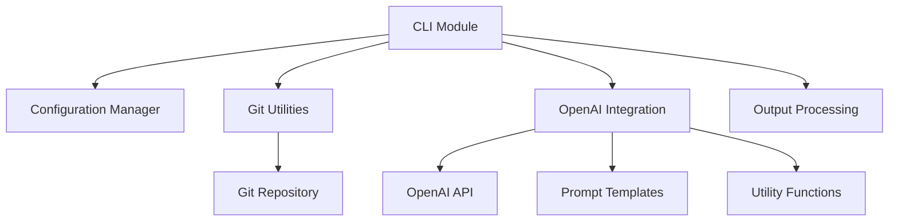
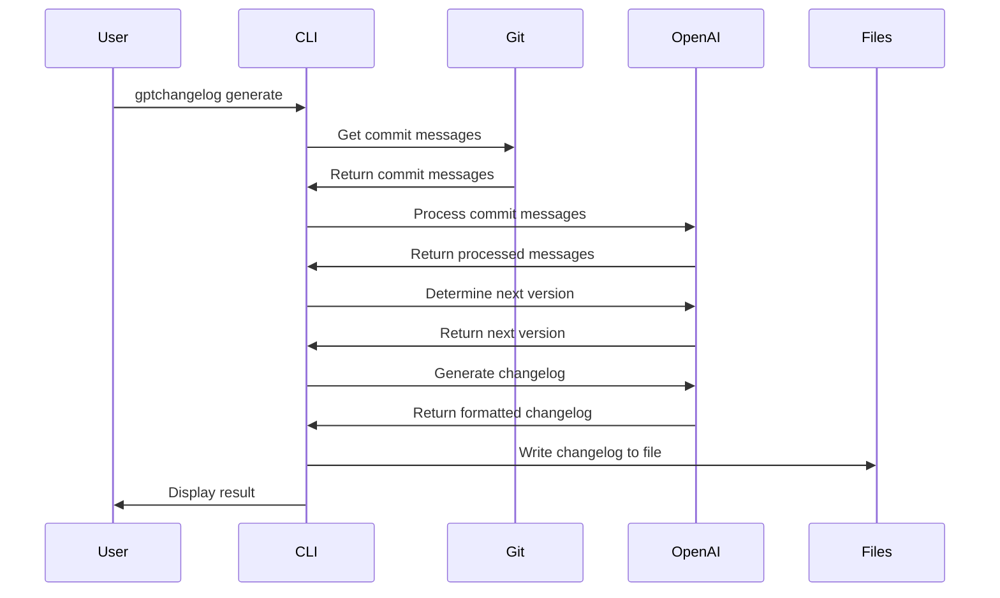
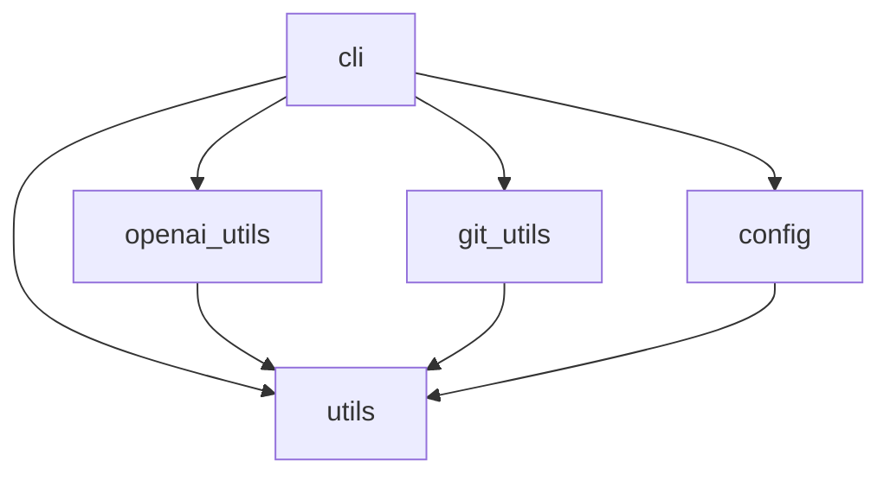

# Architecture

This document provides an overview of GPTChangelog's architecture, its components, and how they interact with each other.

## System Overview

GPTChangelog follows a modular architecture with clear separation of concerns. The system consists of several core components that work together to generate changelogs from git commit history.



## Core Components

### CLI Module (`cli.py`)

The CLI module is the entry point for the application. It:

- Parses command-line arguments
- Handles subcommands (generate, config)
- Coordinates the workflow between other components
- Manages output formatting and user interaction

### Configuration Manager (`config.py`)

The Configuration Manager handles loading, saving, and merging configuration from different sources:

- Project-specific configuration
- Global user configuration
- Environment variables
- Command-line arguments

### Git Utilities (`git_utils.py`)

The Git Utilities module interacts with the git repository:

- Extracts commit messages
- Analyzes commit history
- Determines version information
- Parses conventional commits

### OpenAI Integration (`openai_utils.py`)

The OpenAI Integration module handles communication with the OpenAI API:

- Prepares prompts using templates
- Sends requests to OpenAI
- Processes and sanitizes responses
- Handles error conditions and retries

### Utility Functions (`utils.py`)

The Utility module provides common functionality used across the application:

- Token estimation
- Template rendering
- File manipulation
- Version parsing

## Data Flow

The typical data flow through the system is as follows:

1. User invokes the `generate` command
2. CLI module parses arguments and loads configuration
3. Git utilities extract commit messages from the repository
4. Commit messages are processed and categorized
5. OpenAI integration sends the processed messages to OpenAI
6. The next version is determined based on semantic versioning
7. A changelog is generated using the template
8. The changelog is written to the output file



## Module Relationships

### Package Structure

The GPTChangelog package is organized as follows:

```
gptchangelog/
├── __init__.py           # Package metadata and version
├── __main__.py           # Entry point
├── cli.py                # Command-line interface
├── config.py             # Configuration management
├── git_utils.py          # Git repository interactions
├── openai_utils.py       # OpenAI API integration
├── utils.py              # Utility functions
└── templates/            # Prompt templates
    ├── changelog_prompt.txt
    ├── commits_prompt.txt
    └── version_prompt.txt
```

### Dependency Graph



## Extension Points

GPTChangelog is designed to be extensible. Here are the main extension points:

### Custom Templates

You can provide custom templates for:
- Commit processing
- Version determination
- Changelog generation

These templates can be placed in a `.gptchangelog/templates/` directory.

### Custom Git Integration

The git utilities module can be extended to support additional:
- Repository types
- Commit formats
- Versioning schemes

### Output Formats

The changelog generation can be extended to support additional output formats:
- HTML
- JSON
- Release notes

## Error Handling

GPTChangelog implements a comprehensive error handling strategy:

1. **Configuration Errors**: Handled by providing clear error messages and suggestions
2. **Git Errors**: Handled with appropriate fallbacks and user guidance
3. **API Errors**: Includes retry logic, rate limiting awareness, and fallback behavior
4. **File I/O Errors**: Includes proper error reporting and safe file operations

## Performance Considerations

GPTChangelog addresses several performance considerations:

1. **Large Repositories**: Batch processing for repositories with many commits
2. **Token Optimization**: Smart token usage to minimize API costs
3. **Caching**: Optional caching of API responses for repeated operations
4. **Progress Reporting**: Progress indicators for long-running operations

## Security Considerations

GPTChangelog implements these security measures:

1. **API Key Handling**: Secure storage of API keys
2. **File Permissions**: Safe file operations with proper permissions
3. **Configuration Isolation**: Separation of global and project-specific configuration
4. **Error Sanitization**: Safe error reporting without exposing sensitive information