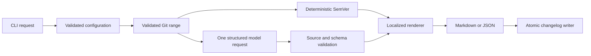

# Architecture

GPTChangelog separates deterministic release mechanics from model-assisted writing.

```mermaid
flowchart LR
    CLI[CLI request] --> Config[Validated configuration]
    Config --> Git[Validated Git range]
    Git --> Version[Deterministic SemVer]
    Git --> Draft[One structured model request]
    Version --> Render[Localized renderer]
    Draft --> Validate[Source and schema validation]
    Validate --> Render
    Render --> Artifact[Markdown or JSON]
    Artifact --> Writer[Atomic changelog writer]
```

## Invariants

The model never controls:

- Git reference resolution
- whether the root commit is included
- the semantic-version increment
- Markdown headings or insertion position
- file replacement and duplicate handling

Model output is accepted only when it satisfies the structured schema and every release-note item refers to commits in the analyzed range.

## Git analysis

The Git layer resolves `--to`, finds the newest reachable tag when `--since` is omitted, and distinguishes a tagged range from an initial untagged release. Invalid refs and Git command failures propagate to the CLI.

Commit analysis produces typed records containing source SHA, message, author, timestamp, changed files, statistics, classification, breaking-change state, issue references, and components. Noise filtering records what was skipped instead of disguising an invalid range as an empty release.

## Version policy

Semantic versioning is deterministic:

- explicit Conventional Commit `!` or a blank-line-separated breaking footer: major
- feature: minor
- fixes and maintenance: patch

The parser validates the current version and preserves an existing `v` prefix. A model response cannot downgrade or otherwise replace the calculated result.

## Generation

The generation path sends at most one request. Commit data is delimited as
untrusted source content. The dynamic strict schema contains a summary, one
required assignment property for every selected commit ID, and bounded shared
topic descriptions. Each assignment's category is fixed by a single-value enum
and its topic is restricted to that category's slots. This makes omitted,
duplicated, or cross-category source coverage structurally impossible while
still consolidating related commits into readable entries.

GPT-5.6 Terra is the balanced default; GPT-5.6 Sol is the quality profile. The OpenAI provider uses the Responses API with Structured Outputs. The Codex provider delegates authentication and execution to the supported Codex client instead of parsing cached credentials.

Large histories are bounded before model use. Inputs above the safety limit use
validated deterministic entries so no source commit is silently truncated.

## Rendering and validation

The renderer owns localized section labels, ordering, headings, links, contributors, and Markdown escaping. Supported locales are English, French, and Spanish.

Validation rejects:

- unresolved template placeholders
- Markdown code fences around the artifact
- malformed or repeated release headings
- unknown source commit IDs
- omitted, repeated, or cross-category source commit IDs
- invalid semantic versions
- empty structured drafts

The old heuristic quality score is not a release gate; actionable validation results are.

## File writing

The writer reads UTF-8, validates the existing document, rejects an existing target version unless forced, preserves `[Unreleased]`, writes a temporary sibling file, flushes it, and atomically replaces the target. Failures propagate and leave the original intact.

## CLI and UI

Diagnostics use stderr. Raw Markdown or JSON uses stdout only for `--dry-run` or `--output -`. Textual is optional and auto-selected only when both input and output are interactive terminals.

The CLI passes repository paths through APIs rather than changing the process-wide working directory.

## Testing strategy

Unit and integration tests cover Git range edge cases, deterministic versions,
provider failures, structured response parsing, localization, writer atomicity,
duplicate releases, output stream separation, non-TTY UI behavior, rendered
Markdown and JSON contracts, and configuration precedence.
